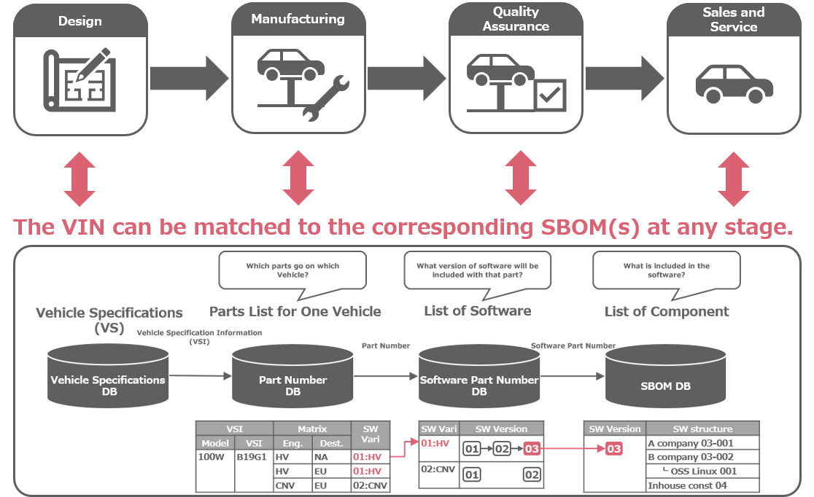
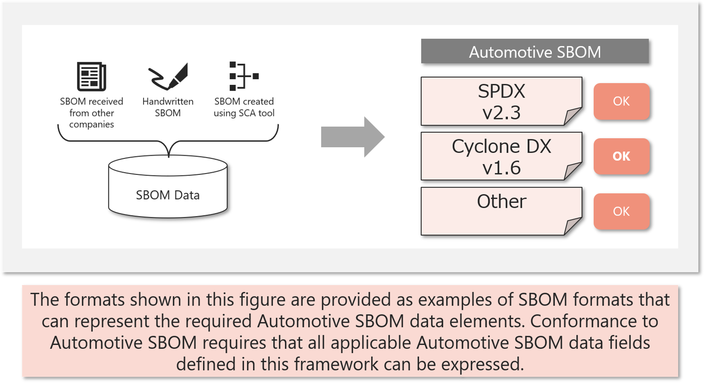
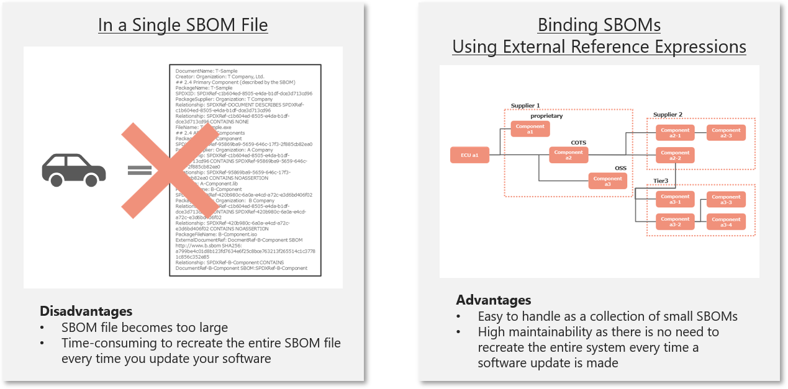

# 1. Overview of Automotive SBOM
## 1.1. Background
SBOM (Software Bill of Materials, a list of the components that make up software) was defined as a means of visualizing the components of software, and is expected to be used in a variety of industries for risk management purposes such as vulnerability and license compliance. The basic SBOM specification definition published by the NTIA of the United States in 2021 is referenced as the de facto global standard, and there are multiple definitions derived from it, but it is defined generically to cover a variety of areas such as SI (system integration) and embedded device development, and when applied to business practices and development methods specific to the automotive industry, issues arise such as the granularity of information and ambiguity of definitions.

## 1.2. Objectives of Automotive SBOM

The Automotive SBOM is defined as a framework that follows general-purpose SBOM specifications while addressing the needs and practices of the automotive industry. The objectives of Automotive SBOM are as follows:

### Enable a Common Language Across the Automotive Supply Chain

Automotive SBOM defines a common set of software component information and terminology to facilitate the accurate and consistent exchange of software configuration information among entities participating in the automotive supply chain. By providing a common framework for SBOM creation and exchange, Automotive SBOM improves transparency and traceability across organizational boundaries.

### Contribute to Improved Efficiency and Productivity

Organizations within the automotive supply chain often require SBOMs in different formats and with different levels of detail, resulting in duplicated effort when creating, maintaining, and exchanging SBOMs. By promoting a common set of requirements, Automotive SBOM reduces this burden and contributes to improved efficiency and productivity throughout the industry.

### Support Software Risk Management

Automotive SBOM provides the information necessary to support software risk management activities, including vulnerability management, license compliance, and supply chain transparency. By enabling consistent identification of software components, Automotive SBOM facilitates reliable analysis and response throughout the software lifecycle.

### Provide Requirements for the SBOM Tool Ecosystem

SBOM information is typically collected and managed using a variety of tools and platforms, but the capabilities of available solutions vary significantly. Automotive SBOM can be used to communicate automotive-specific requirements to the broader SBOM tool ecosystem, including commercial vendors, open source projects, and platform providers. It also provides development teams with objective criteria for evaluating and selecting SBOM generation, management, and analysis solutions.

## 1.3. Automotive-Specific Use Cases

While SBOM concepts are applicable across many industries, the automotive industry has several unique characteristics that influence how SBOM information is created, exchanged, maintained, and utilized. These characteristics include complex multi-tier supply chains, long product lifecycles, ECU-based software architectures, functional safety requirements, and the need for coordinated vulnerability management across multiple stakeholders.

The following examples illustrate representative scenarios in which Automotive SBOM information can provide value. These examples are not intended to be exhaustive, but rather to demonstrate key motivations for establishing a common Automotive SBOM Framework.

#### Collecting SBOMs Across All Supply Chain Tiers

Modern vehicles are developed through highly complex supply chains involving OEMs and suppliers across multiple tiers of the automotive supply chain. Software components delivered by different organizations may ultimately become part of a single vehicle system. Automotive SBOM information can facilitate the collection and management of SBOMs across multiple supply chain tiers, enabling greater visibility into the software composition of vehicle systems and supporting downstream cybersecurity and compliance activities.

#### Long-Term Lifecycle Management

Vehicles often remain in operation for ten years or longer after production. During that period, organizations may need to maintain software, address newly discovered vulnerabilities, provide software updates, and respond to regulatory requirements. Automotive SBOM information can support long-term lifecycle management by providing a consistent record of software components and their relationships throughout the operational lifetime of a vehicle.

#### ECU-Level Configuration Tracking

A vehicle typically contains numerous Electronic Control Units (ECUs), each of which may operate different software stacks, software versions, and configuration variants. Automotive SBOM information can be used to identify and manage the software composition of individual ECUs and vehicle configurations, supporting software inventory management, change tracking, and impact analysis activities.

#### Alignment with Functional Safety Requirements

Software updates intended to address cybersecurity concerns may also need to be evaluated from a functional safety perspective. Understanding which software components are affected by a proposed change is important for assessing both cybersecurity and safety impacts. Automotive SBOM information can provide visibility into software dependencies and component relationships, supporting activities performed in conjunction with functional safety frameworks such as ISO 26262.

#### Integration with VEX and PSIRT Operations

Organizations increasingly use SBOM information as an input to vulnerability management processes. When combined with Vulnerability Exploitability eXchange (VEX) information, SBOM data can assist organizations in determining whether identified vulnerabilities affect specific vehicle software configurations. Automotive SBOM information can also support Product Security Incident Response Team (PSIRT) activities, including vulnerability assessment, prioritization, communication, and remediation planning across the automotive ecosystem.

These examples are not intended to be exhaustive. Rather, they illustrate representative scenarios that motivated the development of this Automotive SBOM Framework and demonstrate how SBOM information can be used throughout the automotive software supply chain and vehicle lifecycle.  
<br>
<br>
<br>

# 2. The Role of SBOM in Vehicle Development
## 2.1. Representation of SBOM for One Car
To achieve SBOM-based management aimed at addressing various risks and complying with regulations while maintaining the traditional vehicle development system, the goal in the future is to represent the SBOM for an entire vehicle by associating management using PLM (Product Lifecycle Management , information management centered on hardware development) with ALM (Application Lifecycle Management , information management centered on software development). An image of how the SBOM for an entire vehicle would be represented is shown in Figure 1.
The HBOM (Hardware Bill of Materials, a list of the hardware that makes up a vehicle, as [HBOM defined by CISA](https://www.cisa.gov/resources-tools/resources/hardware-bill-materials-hbom-framework-supply-chain-risk-management) ) makes it possible to visualize the system structure of components such as ECUs. By associating and managing an SBOM with each of these components, it is possible to understand the software configuration of an entire vehicle. Rather than having one huge SBOM associated with an entire vehicle, the hierarchical structure of the SBOM is used, and the SBOM for each component is bundled using an external reference representation, making it easier to handle and maintain.


Figure 1. SBOM Representation Image for One Car (To Be)

## 2.2. Relationship between Post-shipment Traceability Management and SBOM
The state of a vehicle's software changes due to various reprocessing processes that are carried out after manufacturing and shipping, so the associated SBOM must also be updated accordingly. For this reason, each association is designed to enable traceability from the VIN for individual vehicle management, via the software part number corresponding to that VIN, to the corresponding SBOM. Figure 2 shows an image of traceability management at each stage.
Furthermore, with the widespread use of in-vehicle software updates using OTA technology, it is expected that the software configuration of each vehicle will differ after shipment. Even in this situation, the use of SBOM is expected to become more widespread, as traceability of the corresponding SBOM from the VIN will enable compliance with regulations (such as UN-R156) and reliable vulnerability response.



Figure 2. Post-shipment Traceability Management

<br>
<br>
<br>

# 3. Automotive SBOM Framework
## 3.1. Automotive SBOM Framework Configuration

The Automotive SBOM framework consists of the following definitions:

* Data Fields
  Definition of data items to be handled as SBOM.

* Automation Support
  Document formats that SBOM files should comply with, definitions of each data format, and implementation examples.

* Practice and Process
  Operational methods for requesting, generating, exchanging, and using SBOMs.

The Automotive SBOM framework is intended to support the accurate and consistent exchange of software configuration information throughout the automotive supply chain. It also supports software risk management activities, including vulnerability management, license compliance, and supply chain traceability.

The prerequisites for defining the Automotive SBOM framework are as follows:

1. Data fields are defined as the minimum set of information required to identify and understand the software components contained in managed software.

2. Each data field has an attribute of either Required or Optional. Required data fields shall be provided in all cases. Optional data fields may be included or omitted depending on the implementation requirements, operational requirements, or use cases of each entity. The absence of Optional data fields does not affect conformance to this framework unless otherwise required by industry guidelines, contractual requirements, or organizational policies.

3. There shall be no data fields for dynamic information, such as vulnerability information. Instead, the data fields shall contain information necessary to identify software components and support risk management activities.
   * Components shall be uniquely identifiable and capable of being matched with external sources of information.
   * Data fields shall support the identification of known vulnerabilities, applicable licenses, and software suppliers through external data sources.

4. There shall be no data fields for entity-specific business information, such as vehicle model information. Such information shall be defined separately as implementation-specific schemas outside the scope of this framework.

The relationship between Automotive SBOM and existing industry standards is as follows:

* Standards such as CISA Baseline Attributes, NTIA Minimum Elements, BSI TR-03183, and the 2026 Minimum Elements for a Software Bill of Materials (SBOM) provide a useful foundation for defining SBOM requirements. Automotive SBOM builds upon these standards to support the needs of the automotive industry.

* In addition to commonly used SBOM data fields, Automotive SBOM defines additional requirements and guidance needed to support software risk management, license compliance activities, and the accurate and consistent exchange of software configuration information throughout the automotive supply chain.

* The OpenChain Telco SBOM Guide Version 1.1 is based on SPDX. Automotive SBOM supports mappings to SPDX and other SBOM formats while avoiding restrictions to a single SBOM document format in order to accommodate diverse automotive industry practices.

* Automotive SBOM is intended to evolve together with the needs of the automotive industry. Future revisions may introduce additional automotive-specific requirements, data fields, and representation methods as industry practices, regulations, and software supply chain requirements continue to evolve.

## 3.2. Data Fields
### 3.2.1. Data Field Definitions
The Automotive SBOM data fields are selected to facilitate the accurate and consistent exchange of software configuration information among entities participating in the automotive supply chain, support vulnerability and license management activities, and improve transparency and traceability throughout the supply chain. The data fields represent the minimum information required to achieve these objectives. The rationale and intended use of each data field are described in the following sections.  
The Automotive SBOM data field definitions are shown in Table 1.  
For mappings between Automotive SBOM data fields and equivalent fields in SPDX and CycloneDX, refer to Table 3.

Table 1 Automotive SBOM Data Field Definitions
|#|Automotive SBOM Data Fields|Required|Purpose|
|:--:|:--|:--:|:--|
|1|SBOM Metadata|
|1-1|SBOM Author Name|〇|Identifying the entity that will create the SBOM|
|1-2|SBOM Timestamp|〇|Identifying the development phase of the target component|
|1-3|SBOM Type|〇|Identifying the development phase of the target component|
|1-4|SBOM Primary Component|〇|Identifying target components|
|2|Component Attributes|
|2-1|Component Name|〇|Identifying target components|
|2-2|Component Version|〇|Identifying the version of the component in question|
|2-3|Component Supplier Name|〇|Identifying suppliers of affected components|
|2-4|Component Relationship|〇|Identifying dependencies of target components|
|2-5|Component Unique Identifier|〇|Used to match target components with external data|
|2-6|Component File Name|〇|Identifying the artifact corresponding to the component|
|2-7|Component Download Location|-|Used to check the license of the target component|
|2-8|Component Declared License|-|Used to check the license of the target component|
|2-9|Component Concluded License|〇|Used to check the license of the target component|
|2-10|Component Cryptographic Hash|-|Used to verify the authenticity of the target component|
|2-11|Component Copyright Notice|〇|Used to check the copyright of the target component|
|2-12|Component External Document References|〇|Used to reference externally managed SBOMs and support hierarchical SBOM composition|
  
(Legend: 〇: Required, - :  Optional)  
  
  
The Automotive SBOM data fields are described below.  

<br>

---
### 1.  SBOM Metadata  
####     1.1.  SBOM Author Name  

**Description and Uses**

- Used to uniquely identify the SBOM creation entity.
- This information identifies the entity that created (provided) the SBOM, and should be a company name or individual name. Multiple entities are allowed.
- Include the legal entity name and unique identifier (e.g., email address, website) if available. If the legal entity name is not available, include the name of the SBOM creator along with contact information such as an email address.
- If possible, include information about the tools and versions used by the SBOM creator to create the SBOM (this can be used to judge the quality of the SBOM). Separate the tool name and tool version by "-".

**Specific Examples**

```json
"creators": [
  "Organization: T Company, Ltd.",
  "Tool: BlackDuck - v2024.10.1"
]
```
 
####     1.2.  SBOM Timestamp

**Description and Uses**

- Used to identify the date and time the SBOM was created or updated.
- Shall be represented in UTC using the ISO 8601 format `YYYY-MM-DDThh:mm:ssZ` to ensure consistency across time zones and locales.
- The year shall be represented using four decimal digits. The month, day, hour, minute, and second shall each be represented using two decimal digits with leading zeros as necessary.
- The time shall be expressed in 24-hour notation.
- Fractional seconds shall not be included.

**Specific Examples**

```json
"created": "2025-01-24T22:31:37Z"
```

####     1.3.  SBOM Type

**Description and Uses**

- Used to identify the lifecycle phase and scope of the SBOM.
- Expressed using the CISA SBOM Types described in Chapter 6.4.

**Specific Examples**

```json
"creatorComment": "SBOM Type : Build"
```

####     1.4.  SBOM Primary Component

**Description and Uses**

- Used to identify the target component that the SBOM represents.
- Generally, the name of the target software (product, function name, etc.) is assumed, but the project name or various codes (software product number, etc.) within each entity may also be used.

**Specific Examples**

```json
"name": "T-Sample" (if using the software name)
```

```json
"name": "xxxxx-xxxxx" (if using the software model number)
```

### 2.  Component Attributes  
####     2.1.  Component Name  

**Description and Uses**

- Used to identify the component.
- Generally, the name of the target software (product, function name, etc.) is assumed, but the project name or various codes (software product number, etc.) within each entity may also be used.  

**Specific Examples**

```json
"name": "A-Component" ( if using the function name)
```

```json
"name": "xxxxx-xxxxx" ( if using the software part number)
```

####     2.2.  Component Version  

**Description and Uses**

- A unique identifier of the version of the software component.
- Any versioning scheme may be used, provided that it uniquely identifies the version of the component.

**Specific Examples**

```json
"versionInfo": "1.0.0" (Semantic Versioning)
```

```json
"versionInfo": "2025.09" (Calendar Versioning)
```

```json
"versionInfo": "a1b2c3d4e5f67890abcdef1234567890abcdef12" (Git commit hash)
```

####     2.3. Component Supplier Name

**Description and Uses**

- Used to identify the organization responsible for providing, maintaining, or distributing the component.
- This information supports software supply chain traceability and helps identify the appropriate entity for vulnerability management, license compliance, and lifecycle management activities.
- For COTS or proprietary software, the legal entity name should be used. If necessary, jurisdiction information may be added to distinguish entities with similar names.
- For OSS components, the name of the organization, foundation, company, or project responsible for maintaining the component should be used.
- URLs, domain names, package registry names, and source code hosting services should not be used as supplier values unless they are also the organization responsible for maintaining the component.
- If a component provided by a supplier upstream in the supply chain is used without modification, the name of that supplier should be used in this field. If the component has been modified by the supplier of the SBOM Primary Component, the name of that supplier should be used. Information about the supplier should also be conveyed using the Relationship field.
- The supplier should be identified whenever possible to support software supply chain traceability and lifecycle management activities. If the supplier cannot be determined after reasonable efforts, the SPDX value "NOASSERTION" may be used. The use of "NOASSERTION" should be limited to exceptional cases.

**Specific Examples**

```json
"supplier": "Organization: OpenSSL Software Foundation"
```

```json
"supplier": "Organization: The Apache Software Foundation"
```

```json
"supplier": "Organization: Microsoft Corporation"
```

```json
"supplier": "B-Company"
```

####     2.4.  Component Relationship  

**Description and Uses**

- Used to explain the relationship between the component and other components.  
- The relationships are expressed in the following types:  
  - Primary  
  A type for representing SBOM Primary Component. Specifically, DESCRIBES (in the case of SPDX), or metadata (in the case of CycloneDX) are used.
  - Includes  
  A type used to express when a component is included in or depends on another component. Specifically, CONTAINS, DEPENDS_ON, DEPENDENCY_OF, DYNAMIC_LINK, or STATIC_LINK (in the case of SPDX), or dependencies (in the case of CycloneDX) are used.  
  - Heritage / Pedigree  
  A type used to express that a given component was created by modifying another, higher-level component. Specifically, this can be represented using GENERATED_FROM or DESCENDANT_OF in SPDX, or pedigree in CycloneDX.  
- The completeness of the relationship expression can also be expressed using Unknown, None, Partial, and Known.  

**Specific Examples**

```json
"Relationship": "SPDXRef-2b9b148e-fb5e-3079-2f88-d5e9f39431dc CONTAINS SPDXRef-9811def5-4723-5e3f-2dbd-8c33c9ff62ae"
```

####     2.5. Component Unique Identifier

**Description and Uses**

- Used to uniquely identify a component and enable association with relevant external information.
- The identifier shall support consistent identification of the component across entities participating in the supply chain.
- For OSS components, the use of commonly recognized identifiers(e.g., PURL([Package-URL](https://ecma-international.org/publications-and-standards/standards/ecma-427/)), CPE([Common Platform Enumeration](https://cpe.mitre.org/specification/index.html)), SWID([Software Identification](https://csrc.nist.gov/projects/software-identification-swid/guidelines)), Tagging([ISO/IEC 19770-2:2015](https://www.iso.org/standard/65666.html)), and SWHID([Software Hash Identifier](https://www.softwareheritage.org/software-hash-identifier-swhid/)) ([ISO/IEC 18670:2025](https://www.iso.org/standard/89985.html))) is recommended whenever available. In particular, providing at least one of CPE 2.2, CPE 2.3, or PURL is recommended to facilitate correlation with vulnerability databases and vulnerability management tools.
- For components for which such identifiers are not available, including proprietary or commercial components, alternative identifiers may be used, provided that they uniquely identify the component and support consistent identification of the component across organizations exchanging the SBOM.

**Specific Examples**

```json
"cpe": "cpe:2.3:a:systembom:bomviewer:3.2.1"
```

```json
"purl": "pkg:rpm/sysbom/bomgen"
```

```json
"swid": "65699569-EA51-4346-8BDC-4076FA5C0E72"
```

```json
"swh:1:dir:bc7ddd62cf3d72ffdc365e1bf2dea6eeaa44e185;origin=https://github.com/rdicosmo/parmap;visit=swh:1:snp:8ddca416836fbbc2a7704c69db38739bef6b6cae;anchor=swh:1:rev:ecd3744ed558da4ea2bf9eb87b80b8949f417126"
```

####     2.6.  Component File Name  

**Description and Uses**

- The file name of the software artifact corresponding to the component.
- This information is used to identify the artifact represented by the component when exchanging SBOM information among organizations. It supports traceability between the component and the delivered software artifact and can be used together with artifact-specific information such as hashes, licenses, and vulnerabilities.

**Specific Examples**

```json
"PackageFileName": "B.exe"
```

####     2.7.  Component Download Location  

**Description and Uses**

- The URL to retrieve the component.  
- If the component is open source, use the URL to obtain the source code or binary file of the component being used. A URL that can obtain a version of the component being used is preferable, but it can also be substituted with the URL of the top page of the GitHub repository or the download link on the project's web page.  
- If the component is COTS or proprietary , use "None".  

**Specific Examples**

```json
"PackageDownloadLocation": "http://acompany/a.zip"
```

```json
"PackageDownloadLocation": "None"
```

####     2.8.  Component Declared License  

**Description and Uses**

- A list of the licenses declared by the component’s author. If the component (package) contains multiple license declarations, all of them must be included in this field.  
- License information not provided by the package author, such as license information from a third-party repository, should be expressed in #2.9 Component Concluded License rather than in this field.  
- To identify an OSS license, use the SPDX license identifier, but if one is not defined, use the name of the license as is.  
- This item is optional, and NONE is allowed if there is no declaration by the component creator, and NOASSERTION is allowed if it is unknown.  
- NOASSERTION may be used when declared license information is unavailable, cannot be reasonably determined, or is intentionally not provided, consistent with SPDX semantics. However, the use of NOASSERTION is expected to be limited to such exceptional cases. Whenever reasonably possible, explicit license information should be provided. Because Concluded License is required by Automotive SBOM, the use of NOASSERTION in this field does not indicate that license assessment has not been performed.

**Specific Examples**

```json
"licenseDeclared": "(LGPL-2.0-only AND LicenseRef-3)"
```

####     2.9.  Component Concluded License  

**Description and Uses**

- The concluded license represents the license assessment associated with the component based on available licensing information.
- This information is used to communicate the license assessment of the component when exchanging SBOM information among organizations. It may be used to support license verification, compliance activities, and downstream evaluation of licensing obligations.

**Specific Examples**

```json
"licenseConcluded": "Apache-2.0"
```

####     2.10.  Component Cryptographic Hash  

**Description and Uses**

- A hash value of the component, using SHA-256 or higher algorithm.  
- It is used for purposes such as preventing tampering and verifying authenticity.  

**Specific Examples**

```json
"FileChecksum": "SHA256:5254c46a631572156bd94d61649f8fb30473c150232d28489f88e1d99950b5a8"
```

####     2.11.  Component Copyright Notice  

**Description and Uses**

- Copyright notice associated with the component.  
- The value should contain the copyright notice provided by the component author, copyright holder, or supplier.
- If the copyright information is unavailable, cannot be reasonably determined, or is intentionally not provided, NOASSERTION may be used in accordance with SPDX semantics. Whenever reasonably possible, explicit copyright information should be provided.

**Specific Examples**

```json
"copyrightText": "The Apache Software Foundation"
```

####     2.12.  Component External Document References  

**Description and Uses**

- This field specifies references to external SBOM documents associated with the component.
- It is used to link components to externally managed SBOMs, support hierarchical SBOM structures, and enable vehicle-level SBOM composition by combining separately managed SBOM documents.

**Specific Examples**

```json
"ExternalDocumentRef": "DocumentRef-B-Component SBOM http://www.b.sbom SHA256:e3599f715db5acb8b37f132c5610005d5b849763bc748b2260bc939c225c4342"
```

---

<br>

### 3.2.2. Declared License and Concluded License  
Declared License and Concluded License are license types defined in the SPDX specification, and because they are useful for correctly communicating license information when transferring software between organizations, Automotive SBOM also uses these definitions. However, the concepts of mandatory/optional are not directly consistent with the SPDX specification, and will be explained in detail here.  

Specific examples  
- Case 1: The SBOM creator refines the license declared by the component creator  

        For example, the license notation of the acquired OSS component is "GPL" or "BSD" or the version information that should be specified is unknown, and software containing that OSS component is provided to a third party, that party must identify the version information by examining the source code of the target software, etc., and include the results in the SBOM (Automotive SBOM requirements).  
      In this example, the license expression would be as follows:  
        - Declared License “GPL”, Concluded License “ GPL-3.0-or-later ”  
        - Declared License “BSD”, Concluded License “ BSD-3-Clause ”  

- Case 2: The component creator has not declared the license and the SBOM creator identifies it  

      If the acquired OSS component does not have a clear license declaration, and software containing that OSS component is provided to a third party, that party must identify the version information by, for example, examining the source code of the target software, and include the results in the SBOM (Automotive SBOM requirement).  
      In this example, the license expression would be as follows:  
        - Declared License “NONE”, Concluded License “ GPL-3.0-or-later ”  
        - Declared License “NOASSERTION”, Concluded License “ BSD-3-Clause ”  

- Case 3: The SBOM creator changes the license declared by the component creator  

      For example, the OSS component you acquired is dual-licensed (GPL-2.0-only and a commercial license), and you provide software containing that OSS component to a third party, and that party uses the target software as GPL-2.0-only software, you must state this in the SBOM.  
      In this example, the license expression would be as follows:
        - Declared License "GPL-2.0-only or commercial license",
        - Concluded License "GPL-2.0-only"

### 3.2.3. Checking for Consistency with Existing Industry Standards  
The results of the consistency check against the definitions of data fields in existing industry standards are shown in Table 2.  

Table 2 The Results of the Consistency Check  
|#|Automotive SBOM Data Fields|CISA Baseline Attribute|NTIA Minimum Elements|BSI TR-03183|J-Auto-ISAC SBOM minimum element|2026 Minimum Elements|
|:--:|:--|:--:|:--:|:--:|:--:|:--:|
|1|SBOM Metadata|
|1-1|SBOM Author Name|■|■|■|■|■|
|1-2|SBOM Timestamp|■|■|■|■|■|
|1-3|SBOM Type|■|(□)|-|-|■|
|1-4|SBOM Primary Component|■|-|-|-|-|
|2|Component Attributes|
|2-1|Component Name|■|■|■|■|■|
|2-2|Component Version|■|■|■|■|■|
|2-3|Component Supplier Name|■|■|■|■|■|
|2-4|Component Relationship|■|■|■|■|■|
|2-5|Component Unique Identifier|■|■|■|■|■|
|2-6|Component File Name|-|-|■|-|-|
|2-7|Component Download Location|-|-|-|-|-|
|2-8|Component Declared License|■|-|□|-|□|
|2-9|Component Concluded License|-|□|■|□|■|
|2-10|Component Cryptographic Hash|■|□|□|□|■|
|2-11|Component Copyright Notice|■|-|-|-|-|
|2-12|Component External Document References|-|-|-|□|-|
  
(Legend: ■: Required, □: Additional or Optional, - :  Not applicable)  

Below is a list of data fields required by existing industry standards that are not supported in Automotive SBOM, along with the reasons for not supporting them.  
- CISA Baseline Attribute  
    All are supported.
- NTIA Minimum Elements  
	All are supported.  
- BSI TR-03183  
  - Associated licenses ( Required )  
    License verification is possible through the Component Concluded License .  
  - Hash value of the deployable component ( Required )  
    Because it can be replaced by Component Cryptographic Hash .
  - Executable property ( Required )  
    This is not information required for subsequent SBOM management.  
  - Archive property ( Required )  
    This is not information required for subsequent SBOM management.  
  - Structured property ( Required )  
    This is not information required for subsequent SBOM management.  
  - Source code URI ( Additional )  
    This can be replaced by the Component Download Location.  
  - URI of the deployable form of the component ( Additional )  
    This can be replaced by the Component Download Location .  
- J-Auto-ISAC　SBOM minimum element  
  All are supported.  
* 2026 Minimum Elements for a Software Bill of Materials (SBOM)

  - Component License  
    License verification is possible through the Component Declared License and Component Concluded License.

  - Component Hash Value  
    Because it can be replaced by Component Cryptographic Hash.

  - Component Hash Algorithm  
    Because the algorithm is included as part of Component Cryptographic Hash.

  - SBOM Generation Context  
    Can be partially represented by SBOM Type.

  - SBOM Author Signature  
    This is currently outside the scope of Automotive SBOM Version 1.0.

  - SBOM Tool Name  
    This is currently outside the scope of Automotive SBOM Version 1.0.

  - SBOM Tool Version  
    This is currently outside the scope of Automotive SBOM Version 1.0.

  - SBOM Version  
    This is currently outside the scope of Automotive SBOM Version 1.0.

  - SBOM Data Format Name  
    This is currently outside the scope of Automotive SBOM Version 1.0 (typically provided by the underlying SBOM format, such as SPDX or CycloneDX).

  - SBOM Data Format Version  
    This is currently outside the scope of Automotive SBOM Version 1.0 (typically provided by the underlying SBOM format, such as SPDX or CycloneDX).

## 3.3. Automation Support  
### 3.3.1. Document Format Definition  
Automotive SBOM does not prescribe any specific SBOM document format or version. Any SBOM document format or version may be used, provided that the required data fields defined in Chapter 3.2 can be expressed. At the time of publication, examples of supported formats include SPDX 2.x/3.x and CycloneDX 1.4/1.5/1.6/1.7. Future versions of these formats may also be used without requiring revision of this framework. For smooth SBOM exchange, conformance with both the Automotive SBOM framework and the specification of the chosen SBOM document format is required.  

The objective of Automotive SBOM is to facilitate the accurate and consistent exchange of software configuration information among entities participating in the automotive supply chain. Automotive SBOM provides a common framework for defining the SBOM information to be exchanged, rather than mandating a particular implementation method.

Automation is an important objective of SBOM adoption, particularly for vulnerability management, software inventory management, regulatory compliance activities, and coordination across complex automotive supply chains. Machine-readable formats such as SPDX and CycloneDX are generally preferred for these use cases because they enable efficient automated processing and integration with other systems.

However, organizations may have different levels of maturity, tooling, and SBOM adoption. Therefore, Automotive SBOM focuses on defining common data elements rather than prescribing a specific implementation approach. Organizations may use manual, automated, or hybrid approaches to create and maintain SBOMs, provided that the resulting SBOM information meets the requirements of this framework.  

By defining a common set of Automotive SBOM data elements independently of any specific tool or document format, this framework aims to improve interoperability among organizations using different SBOM solutions. While format conversion or tool integration may still be required in some environments, adoption of a common Automotive SBOM data model can reduce organization-specific customization, proprietary information requests, and information mapping efforts across the automotive supply chain.  




Figure 3. Automotive SBOM Document Format

### 3.3.2. Checking for Consistency with Existing Industry Standards  
Table 3 shows the results of the coverage check of the standard format of the SBOM document (whether the content of the SBOM document expressed in that format meets the data field requirements of the Automotive SBOM).   

Table 3 SBOM Document Standard Format Coverage Check  
|#|Automotive SBOM Data Fields|SPDX Lite @SPDX 2.3|ISO/IEC 5962:2021 (SPDX 2.2.1)|CycloneDX v1.6 (ECMA-424)|
|:--:|:--|:--|:--|:--|
|1|SBOM Metadata|
|1-1|SBOM Author Name|(6.8) Creator|(6.8) Creator:|metadata.authors|
|1-2|SBOM Timestamp|(6.9) Created|(6.9) Created:|metadata.timestamp|
|1-3|SBOM Type|-|(6.10) CreatorComment :|metadata.lifecycles|
|1-4|SBOM Primary Component|-|(11.1) Relationship: DESCRIBES|metadata.component|
|2|Component Attributes|
|2-1|Component Name|(7.1) Package Name|(7.1) PackageName :|components[].name|
|2-2|Component Version|(7.3) Package Version|(7.3) PackageVersion :|components[].version|
|2-3|Component Supplier Name|(7.5) Package Supplier|(7.5) Package Supplier :|metadata.supplier, components[].supplier|
|2-4|Component Relationship|-|(11.1) Relationship: CONTAINS|dependencies []. dependsOn|
|2-5|Component Unique Identifier|(6.5) SPDX Document Namespace, (7.2) Package SPDX Identifier, (7.21 ) External Reference field : SECURITY|(6.5) SPDX Document Namespace, (7.2) SPDXID: ,(7. 21 ) ExternalRef : SECURITY|serialNumber + version, components[]. cpe, components[].purl|
|2-6|Component File Name|(7. 4) Package File Name|(7. 4) packageFileName :|components[].evidence[].identity[].methods[].[{"technique":"filename","confidence".0.1,"value":<"FileName">}]|
|2-7|Component Download Location|(7. 7) Package Download Location|(7. 7) PackageDownloadLocation :|components [] . externalReferences []|
|2-8|Component Declared License|(7.15) Declared License|(7.15) PackageLicenseDeclared :|components[].licenses[], components[].licenses[].acknowledgement[ declared ]|
|2-9|Component Concluded License|(7.13) Concluded License|(7.13) PackageLicenseConcluded :|components[].licenses[], components[].licenses[].acknowledgement[concluded]|
|2-10|Component Cryptographic Hash|-|(7.10) PackageChecksum :, (7.9) PackageVerificationCode :|components[].hashes[]|
|2-11|Component Copyright Notice|(7.17) Copyright Text|(7.17) PackageCopyrightText :|components[].copyright|
|2-12|Component External Document References|-|( 6.6 ) ExternalDocumentRef :|components [] . externalReferences|
  
(Legend: - :  Not applicable)  

### 3.3.3. Specific Expression Method (SPDX v2.3 format)  
Below is an example of Automotive SBOM expressed in SPDX v2.3 format.

```json
{
    "SPDXID": "SPDXRef-DOCUMENT",
    "creationInfo": {
        "creators": [
            "Organization: A Motor Corporation(Example Company Name)",
            "Tool: Example Tool v0.11.1 (version information)"
        ],
        "created": "2025-01-01T05:55:55Z",
        "comment": "SBOM Type: Build"
    },
    "dataLicense": "CC0-1.0",
    "name": "automotive",
    "spdxVersion": "SPDX-2.3",
    "documentNamespace": "https://example.com/spdx/automotive",
    "packages": [
        {
            "SPDXID": "SPDXRef-custom-AAA-AAA-1.1.1-2025-01-01",
            "name": "AAA-AAA(Example Software Identifier)",
            "versionInfo": "1.1.1",
            "supplier": "Organization: A Motor Corporation (Example Company Name)",
            "packageFileName": "AAA-AAA.tar.gz",
            "downloadLocation": "NONE",
            "checksums": [
                {
                    "algorithm": "SHA256",
                    "checksumValue": "83a33ff09648bb5fc5272baca88cf2b59fd81ac4cc6817b86998136af368708e"
                }
            ],
            "licenseConcluded": "Apache-2.0",
            "copyrightText": "(C) 2025 A MOTOR CORPORATION. (Copyright Notice) ",
            "externalRefs": [
                {
                    "referenceCategory": "SECURITY",
                    "referenceType": "cpe23Type",
                    "referenceLocator": "cpe:2.3:a:*:xxxxxx:1.1.1:*:*:*:*:*:*:*",
                    "comment": ""
                }
            ]
        }
    ],
    "relationships": [
        {
            "spdxElementId": "SPDXRef-DOCUMENT",
            "relationshipType": "DESCRIBES",
            "relatedSpdxElement": "SPDXRef-custom-AAA-AAA-1.1.1-2025-01-01"
        }
    ]
}
```

## 3.4. Practice and Process  
### 3.4.1. SBOM File References  
As described in Chapter 2.1, the SBOM file for a single vehicle is not represented as a single large SBOM file, but rather as a collection of multiple small SBOMs for each component part, bundled together using external references.  



Figure 4. How to Represent an SBOM File for One Vehicle and Its Advantages and Disadvantages
  

Figure 5 shows an image of the reference relationship between the target software and its corresponding SBOM file.  
  


Figure 5. Image of Reference Relationship in SBOM File

In this case, the contents (excerpt) of the SBOM files for T-Sample and B-Component are as follows:  

T-Sample SBOM file

    ## Document Information
    SPDXVersion: SPDX-2.3
    DataLicense: CC0-1.0
    SPDXID: SPDXRef-DOCUMENT
    DocumentName: T-Sample
    DocumentNamespace: https://example.com/spdx/T-Sample

    ## Creation Information
    Creator: Organization: T Company, Ltd.
    Creator: Tool: SCA tool - v0.11.1
    Created: 2025-01-01T05:55:55Z

    ## 2.4 Primary Component (described by the SBOM)
    PackageName: T-Sample
    SPDXID: SPDXRef-c1b604ed-8505-e4da-b1df-dce3d713cd96
    PackageSupplier: Organization: T Company
    PackageDownloadLocation: NOASSERTION
    PackageFileName: T-Sample.exe
    PackageCopyrightText: (C) 2025 T Company.

    Relationship: SPDXRef-DOCUMENT DESCRIBES SPDXRef-c1b604ed-8505-e4da-b1df-dce3d713cd96
    Relationship: SPDXRef-c1b604ed-8505-e4da-b1df-dce3d713cd96 CONTAINS NONE

    ## 2.4 All-Levels Components
    PackageName: A-Component
    SPDXID: SPDXRef-95869ba9-5659-646c-17f3-2f885cb82ea0
    PackageSupplier: Organization: A Company
    PackageDownloadLocation: NOASSERTION
    PackageFileName: A-Component.lib

    Relationship: SPDXRef-c1b604ed-8505-e4da-b1df-dce3d713cd96 CONTAINS SPDXRef-95869ba9-5659-646c-17f3-2f885cb82ea0
    Relationship: SPDXRef-95869ba9-5659-646c-17f3-2f885cb82ea0 CONTAINS NOASSERTION	

    PackageName: B-Component
    SPDXID: SPDXRef-420b980c-6a0a-e4cd-a72c-e3d6bd406f02
    PackageSupplier: Organization: B Company
    PackageDownloadLocation: NOASSERTION
    PackageFileName: B-Component.iso
    ExternalDocumentRef: DocumentRef-B-Component https://www.b.sbom SHA256: a799be4c01d8b123fd7634e6f25c8bce763213f265514c1c37781c856c352e85

    Relationship: SPDXRef-c1b604ed-8505-e4da-b1df-dce3d713cd96 CONTAINS SPDXRef-420b980c-6a0a-e4cd-a72c-e3d6bd406f02
    Relationship: SPDXRef-420b980c-6a0a-e4cd-a72c-e3d6bd406f02 CONTAINS NOASSERTION	

    Relationship: SPDXRef-420b980c-6a0a-e4cd-a72c-e3d6bd406f02 DESCRIBED_BY DocumentRef-B-Component

B-Component SBOM file

    ## Document Information
    SPDXVersion: SPDX-2.3
    DataLicense: CC0-1.0
    SPDXID: SPDXRef-DOCUMENT
    DocumentName: B-Component SBOM
    DocumentNamespace: https://example.com/spdx/B-Component

    ## Creation Information
    Creator: Organization: B Company, Ltd.
    Creator: Tool: SCA tool - v0.11.1
    Created: 2025-01-01T05:55:55Z

    ## 2.4 Primary Component (described by the SBOM)
    PackageName: B-Component
    SPDXID: SPDXRef-8ff4a961-c5a9-b275-80da-e6c7f5a8d0a9
    PackageSupplier: Organization: B Company
    PackageDownloadLocation: NOASSERTION
    PackageFileName: B-Component.iso
    PackageCopyrightText: (C) 2025 B Company.

    Relationship: SPDXRef-DOCUMENT DESCRIBES SPDXRef-8ff4a961-c5a9-b275-80da-e6c7f5a8d0a9
    Relationship: SPDXRef-8ff4a961-c5a9-b275-80da-e6c7f5a8d0a9 CONTAINS NONE

    ## 2.4 All-Levels Components
    PackageName: C-OSS-Component
    SPDXID: SPDXRef-47bbd860-11af-2a57-2210-a039bf50fde3
    PackageSupplier: Organization: C Community
    PackageDownloadLocation: NOASSERTION
    PackageFileName: C-Component.pkg
    PackageChecksum: SHA256: 9c50067a4da56808c6cfe11d6b71e1507c6115d2c22004ad7d3f6d4409367358

    Relationship: SPDXRef-8ff4a961-c5a9-b275-80da-e6c7f5a8d0a9 CONTAINS SPDXRef-47bbd860-11af-2a57-2210-a039bf50fde3
    Relationship: SPDXRef-47bbd860-11af-2a57-2210-a039bf50fde3 CONTAINS NOASSERTION	

### 3.4.2. SBOM Request  
(Additional information will be added in due course)  

### 3.4.3. Generation of SBOM  
(Additional information will be added in due course)  

### 3.4.4. Operational Methods for Using SBOM  
(Additional information will be added in due course)  

### 3.4.5. Use of SBOM Information for Vulnerability Management

One of the important applications of Automotive SBOM is vulnerability management throughout the automotive software supply chain and vehicle lifecycle.

Automotive SBOM can support vulnerability management by providing software component identification information. Information such as component names, versions, Package URL (PURL), Common Platform Enumeration (CPE), cryptographic hash values, and supplier information can be used to correlate software components with vulnerability information obtained from external sources.

Organizations can use this information to determine whether software components contained in an Automotive SBOM are affected by known vulnerabilities. Vulnerability information may be obtained from vulnerability databases, security advisories, Vulnerability Exploitability eXchange (VEX) documents, or other vulnerability intelligence sources.

The primary purpose of Automotive SBOM is to identify software components and their relationships. Automotive SBOM does not define vulnerability assessment procedures, vulnerability reporting processes, exploitability analysis methods, or remediation activities. Such activities may be managed through organizational vulnerability management processes, Product Security Incident Response Team (PSIRT) activities, VEX documents, or other complementary mechanisms.

By providing a common set of software component identification information, Automotive SBOM can facilitate consistent vulnerability management activities across organizations while remaining independent of any specific vulnerability management process, tool, or workflow.

### 3.4.6. Use of Concluded License Information

Concluded License information can support license compliance activities by representing the license determination associated with a software component.

In some cases, the license associated with a software component can be identified automatically from source files, package metadata, or other available information. However, license determination may also require human review when multiple license notices exist, licensing information is incomplete, or the applicable license obligations are unclear.

The process used to determine Concluded License information may vary among organizations. Such activities may involve open source compliance teams, legal specialists, engineering teams, or other organizational functions responsible for software compliance.

Automotive SBOM does not prescribe how Concluded License information is generated, reviewed, approved, or maintained. The purpose of Automotive SBOM is to provide a consistent mechanism for exchanging concluded license information when it is available.

Organizations may use automated, manual, or hybrid approaches to establish and maintain Concluded License information depending on their tools, processes, and compliance requirements.

<br>
<br>
<br>

# 4. SBOM-related Regulations and Industry Standards  
## 4.1. Situation in Each Country  
### 4.1.1. Trends in the United States  
The US government has been actively promoting SBOM since 2018. The automotive industry is primarily regulated by the Department of Transportation, but is influenced by policies and requirements from other agencies.  
#### Department of Transportation - National Highway Traffic and Safety Administration
While NHTSA does not explicitly require automakers to create and utilize SBOMs, in its September 2022 paper, “Cybersecurity Best Practices In Practices for the Safety of Modern Vehicles," the paper introduces SBOM as a method for implementing detailed voluntary cybersecurity practices.  

#### Cybersecurity and Infrastructure Security Administration
CISA is the cybersecurity division of the U.S. Department of Homeland Security and the central agency promoting SBOM, providing guidance to the executive branch of the U.S. government on cybersecurity best practices. CISA is also the primary oversight agency for implementing cybersecurity-related policies ( EO: 14028 “Improving the Nation's Cybersecurity” , EO: 13636 “Improving Critical Infrastructure Cybersecurity” , PPD: 21 “Critical Infrastructure Security and Resilience” , EO: 13960 “Promoting the Use of Trustworthy Artificial Intelligence in the Federal Government” ).  
In July 2026, CISA, in collaboration with the NSA, FBI, and multiple international cybersecurity agencies, published the “2026 Minimum Elements for a Software Bill of Materials (SBOM)” guidance, which updates and replaces the original NTIA 2021 SBOM minimum elements. The guidance reflects advances in SBOM tooling, broader industry adoption, and evolving software supply chain security requirements. It expands the minimum data fields required in an SBOM by introducing additional metadata and integrity-related information, including SBOM author signatures, SBOM format and version information, generation context, tool information, component hashes, and license data. The guidance also strengthens expectations for software component identification, dependency tracking, machine-readable formats, SBOM maintenance, and distribution practices. Although the document does not create new regulatory requirements, it establishes the most current U.S. government baseline for SBOM content and is expected to influence future procurement requirements, cybersecurity frameworks, and software supply chain risk management practices across critical infrastructure sectors, including the automotive industry.  

#### Food and Drug Administration
The FDA, which regulates the medical device industry, was the first regulatory authority to require advanced cybersecurity features in the design, manufacture, and operation of regulated devices, and has mandated that SBOMs will be mandatory for FDA approval of all new medical devices starting in 2023. This is the first time that SBOMs have been mandated by regulation.

#### Department of Defense
The U.S. Department of Defense (DoD) is a major purchaser of automotive products, including cars, trucks, military vehicles, and related software and equipment. The DoD has an extensive list of requirements for military and non-military equipment, including the Federal Acquisition Regulation, the Defense Federal Acquisition Regulation Supplement, and the Federal Risk and Authorization Management Program, which primarily covers cloud services, and emphasizes the need for SBOM as a critical element of cybersecurity supply chain risk management. While there are currently no regulations requiring SBOM, it is likely that they will be adopted in a proposal to add requirements to the FAR (information as of December 4, 2023).  
Based on these trends, the automotive industry must prepare for SBOM requirements for software products. While SBOM for vehicles and other cyber-physical systems is not explicitly addressed, it is likely that they will be required as DoD procurements increase.  

#### National Institute of Standards and Technology
NIST, part of the Department of Commerce, publishes standards for SBOM and other software and hardware cybersecurity features at the direction of the White House, which impact the automotive industry by defining specifications for regulations and requirements issued by other U.S. government agencies.

#### Department of Energy
The electric power industry regulator, has clear national security implications and has adopted restrictive policies regarding information sharing outside the industry. Idaho National Labs is actively involved in developing and disseminating SBOM guidance for the energy industry. Certain portions of DoE guidance apply directly to the automotive industry, specifically including authority over the U.S. power grid, including charging stations for electric vehicles.  

#### Federal Communications Commission
The FCC administers the Cyber Trust Mark, which certifies compliance with minimum security and supply chain requirements for IoT devices (this program excludes automobiles and automotive equipment, as they are regulated by the NHTSA).  

### 4.1.2. Trends in the Europe  
#### Cyber Resilience Act (CRA) and Related Regulations and Guidance
The EU Cyber Resilience Act (CRA) entered into force in December 2024. As of October 2026, the CRA's vulnerability and incident reporting requirements are already in effect, while the majority of the Act's cybersecurity requirements will become fully applicable in December 2027. The CRA introduces cybersecurity and software transparency requirements, including support for SBOM-related practices, for a broad range of products with digital elements. Vehicles and certain other product categories are covered by sector-specific regulations and are therefore generally exempt from the CRA.  

#### Federal Office for Information Security - Germany
Germany's cybersecurity government agency, is considering SBOM as part of the CRA. BSI developed a vulnerability notification standard called CSAF, and the U.S. CISA and a private working group adopted CSAF as the primary format for the VEX program, which allows suppliers to advise vendors of exploitability of vulnerabilities and provide remediation actions. SBOM, CSAF, and vulnerability data from the NVD enable end users to automate vulnerability processing and identify vulnerable components in their software inventory.  

### 4.1.3. Trends in Japan  
#### Ministry of Economy, Trade and Industry (METI)
Ministry of Economy, Trade and Industry (METI) continues to promote the adoption and practical use of Software Bill of Materials (SBOM) as part of Japan's software supply chain security and international standardization initiatives. Following the publication of the initial SBOM guidance in July 2023, METI released Guidance on Introduction of Software Bill of Materials (SBOM) for Software Management Ver. 2.0 in August 2024. The updated guidance expands beyond SBOM generation and includes vulnerability management processes, SBOM implementation models, contractual considerations, and practical adoption approaches for software suppliers and procuring organizations.  

METI has also been actively involved in international SBOM standardization efforts. In September 2025, METI joined cybersecurity authorities from multiple countries in endorsing A Shared Vision of Software Bill of Materials (SBOM) for Cybersecurity, establishing a common international vision for SBOM-based software transparency, vulnerability management, and Secure-by-Design practices.  

In July 2026, METI and Japan's national cybersecurity authorities further co-signed the international guidance 2026 Minimum Elements for a Software Bill of Materials (SBOM), led by CISA and international partners.  

As of October 2026, while SBOM adoption is not generally mandated under Japanese law, METI guidance and international SBOM frameworks are increasingly referenced in software procurement, supply chain security programs, Secure-by-Design initiatives, and emerging cybersecurity regulations such as the EU Cyber Resilience Act (CRA). Organizations that develop, procure, or operate software are therefore expected to establish capabilities for SBOM generation, sharing, validation, and vulnerability management.  

## 4.2. Industry Trends  
### Health Sector
#### Health Information Sharing and Analysis Center (H-ISAC)
H-ISAC is conducting a long-term proof-of-concept (PoC) on the use of SBOMs between Medical Device Manufacturers Association members and Health Delivery Organizations ( HDOs, etc. ). H-ISAC has also launched a pilot for an SBOM clearinghouse, where MDMA members can upload their SBOMs to a central, access-controlled database that is accessible to the U.S. FDA for compliance purposes and selectively accessible to their HDO customers.  
### Energy Sector
#### Energy Public/Private Proof of Concept (Sponsored by the U.S. Department of Energy)
Promoting SBOM PoC by electric power companies and others.  

### Information and Communications Technology
Red Hat's comprehensive security information program including a new implementation of SBOM and VEX, Cisco's contributions to the US NTIA and CISA SBOM programs since 2018, and Google's Android project's explanation of the steps for creating an SBOM for developers and their approach to SBOM in the project.


## 4.3. Industry Standard  
### Society of Automotive Engineers
In January 2024, the Society of Automotive Engineers became the first standards body to consider SBOM for the automotive industry, and this effort, as a subtask force under the Vehicle Cybersecurity Systems Engineering Committee (TEVEES18A), is actively collaborating with Auto-ISAC's SBOM project to harmonize standards and practices. SAE is also collaborating with ISO36 on several standards for the automotive and aviation industries, the most relevant of which is ISO/SAE 21434. SAE continues to collaborate with ISO on new versions of applicable standards and for the potential inclusion of SBOM in new versions of ISO/SAE 21434.  

### International Organization for Standardization (ISO/SAE 21434, 5962:2021, TC 292/22373,26262)
ISO works to set standards for many industries, including automotive, and several of its standards are relevant to SBOM (ISO/SAE 21434, 5962:2021 SPDX 2.2.1, TC292/ISO 22373 Cybersecurity and Resiliency in Supply Chains, ISO 26262).  

### UNECE Regulations
The United Nations Economic Commission for Europe's World Forum for Harmonization of Vehicle Regulations has approved two rules closely related to SBOM: UNECE WP.29/R155 requires OEMs to monitor and track cybersecurity issues related to their vehicles, and UNECE WP.29/R156 requires an update mechanism for loading new software onto vehicles to fix vulnerabilities.  

<br>
<br>
<br>

# 5. References  
- 2021 The Minimum Elements For a Software Bill of Materials (SBOM)  
  https://www.ntia.gov/report/2021/minimum-elements-software-bill-materials-sbom

- 2026 Minimum Elements for a Software Bill of Materials (SBOM)
  https://www.cisa.gov/resources-tools/resources/2026-minimum-elements-software-bill-materials-sbom

- Framing Software Component Transparency (2024)
  https://www.cisa.gov/resources-tools/resources/framing-software-component-transparency-2024

- Technical Guideline TR-03183: Cyber Resilience Requirements for Manufacturers and Products  
  https://www.bsi.bund.de/EN/Themen/Unternehmen-und-Organisationen/Standards-und-Zertifizierung/Technische-Richtlinien/TR-nach-Thema-sortiert/tr03183/TR-03183_node.html

- Types of Software Bill of Materials (SBOM)
  https://www.cisa.gov/resources-tools/resources/types-software-bill-materials-sbom

- Cybersecurity Best Practices for the Safety of Modern Vehicles (2022)  
  https://www.transportation.gov/regulations/federal-register-documents/2022-19507

<br>
<br>
<br>

# Appendix A. Terminology
- **SBOM data** The data that makes up the SBOM, a collection of each data field and its corresponding value.  
- **SBOM file** SBOM data corresponding to any software is represented as a single file.  
- **SBOM Document Format** A format for writing SBOM documents. Typical examples(standard SBOM document formats) include The Software Package Data Exchange(SPDX) and CycloneDX(various versions).  
- **Direct Use Parts** Components that are directly used by developers with whom a contract exists in the supply chain(quoting the definition from the Ministry of Economy, Trade and Industry's "Guidelines for Implementing SBOM for Software Management").  
- **Indirectly used parts** Parts that are reused from parts provided by suppliers(third parties) with whom there is no contractual relationship in the supply chain(quoting the definition from the Ministry of Economy, Trade and Industry's "Guidelines for Implementing SBOM for Software Management").  
- **component** The program components that make up software.  
- **OSS (Open-Source Software)** Software whose source code is publicly available and can be used freely by anyone.  
- **COTS (Commercial Off-The-Shelf)** Commercially available, off-the-shelf software. COTS software may use OSS, be sold with support and warranties, or be developed using other COTS software.  
- **Proprietary Software** In this document, it refers to software that does not fall under either OSS or COTS, such as in-house developed software or contracted development. Proprietary software can be developed using OSS or COTS.  

<br>
<br>
<br>

# Appendix B. Supplemental Information
## B.1 License Type Definition in SPDX
Why are there two different license fields for a package (Concluded License and Declared License)?  
The **Concluded** License field is the license the SPDX file creator believes governs the package. The **Declared** License is what the authors of a project believe governs the package. Often these fields have the same value. When they are different the SPDX file creator should provide background information in the Comments on License field.  

## B.2 License Type Definitions in BSI
**Declared** licenses are all licenses that have been declared by the creator of a component.  
A special case is that the primary licensee is forced by the component creator to choose from different sets of licenses which are mutually exclusive. A classic example is Qt where the primary licensee has to decide between GPL and a proprietary license; only the made choice can be handed further down the supply chain. Hence the associated licenses can differ from the declared licenses.  

**Associated** licenses are all licenses under which a component can be used by the licensee.  

**Concluded** licenses are determined by the licensee that is the component creator of the primary component of the current SBOM.  
The statement about multiple component instances with different meta-information also applies if only the license information differs.  

## B.3 License Notation Example
OSS licenses in the Automotive SBOM are represented using identifiers defined in the SPDX License List.
Because software may be provided under a choice of more than one license, or because a set of licenses may be needed to represent a binary program built by compiling and linking several different source files, each covered by a different license, predefined operators (such as AND, OR, WITH, +, etc.) can be used to express this.

- If you need to comply with more than one license at the same time

  `LGPL-2.1-only AND MIT`

- If offered under one or more license options

  `LGPL-2.1-only OR MIT OR BSD-3-Clause`

- If special exceptions apply to a particular license

  `GPL-2.0-or-later WITH Bison-exception-2.2`

- To represent the current or later version of the License

  `CDDL-1.0+`

## B.4 SBOM Types Definitions in CISA
### Design SBOM
- SBOM is created based on planning information before software development, even if the components do not yet exist.  
- Created based on specifications, RFPs, etc.  
### Source SBOM  
- An SBOM created based on the development environment, including the source files and dependencies used to build the product artifacts  
- It is based on information from software composition analysis tools and, if necessary, manually created and modified.  
### Build SBOM  
- Generate an SBOM as part of your software build process to create a releasable artifact from data such as source files, dependencies, built components, temporary data from the build process, and other SBOMs.  
- It is created based on the Source SBOM and information needed for the build process.  
### Analyzed SBOM  
- Generate SBOM through analysis of post-build artifacts (executables, packages, containers, virtual machine images, etc.)  
- It is created based on the output of third-party analysis tools (such as binary analysis tools).  
### Deployed SBOM  
- An SBOM is an inventory (list) of software on a system, consisting of a combination of software and configuration information used depending on the deployment environment (for example, a combination with other Build SBOMs).  
- It is created based on the SBOM and its configuration information as it is installed on the system.  
### Runtime SBOM  
- SBOM of the entire system when the software is running on the system  
- Created based on information about the software that actually runs in the system's execution environment  

## B.5 Definition of SBOM Levels in BSI TR-03183
#### Top-level SBOM


Figure BSI-1. Top-level SBOM

- In addition to a complete description of the major component, the SBOM includes a complete description of all components on which the major component directly depends.  
#### n-level SBOM


Figure BSI-2. n-level SBOM

- In addition to the full description of the major component, the SBOM contains a full description of all components that are directly or indirectly dependent on the major component at n levels, which means that recursive resolution of transitive dependencies is limited to a depth of n levels.  
- Top-level SBOM corresponds to a 1-level.  
#### Transitive SBOM


Figure BSI-3. Transitive SBOM

- In addition to a full description of the major components, the SBOM contains information about all components that are directly or indirectly dependent on the major component. A full description and recursive resolution of components and their dependencies is performed on each pass up to at least the first external component (i.e., a third-party component). This component must also be fully described in the SBOM, excluding its dependencies; dependencies on external components do not need to be resolved.  
- the Transitive SBOM has less information about this external component compared to the first external component on the path at level n-1.  
#### Delivery item SBOM


Figure BSI-4. Delivery item SBOM

- In addition to a complete description of the major components, the SBOM contains a complete description of all components that belong to the scope of delivery and that are directly or indirectly dependent on the major components. A complete description and recursive resolution of components and their dependencies is performed at least for each pass that includes the first component outside the scope of delivery. This component must also be fully described in the SBOM , excluding its dependencies (which do not need to be resolved).  
#### Complete SBOM


Figure BSI-5. Complete SBOM

- In addition to a complete description of the major components, the SBOM includes a complete description of all components that directly or indirectly depend on the major components. The components and their dependencies are fully described and recursively resolved.  

<br>
<br>
<br>

# Appendix C. Contributors

The Automotive SBOM Framework is developed through the collaborative efforts of the OpenChain Automotive Work Group.

The editors would like to thank all individuals who contributed to the development, review, and maintenance of this specification.

## Editors

- Ayumi Watanabe
- Keisuke Takase
- Masato Endo

## Contributors
Contributors are listed alphabetically.

<br>
<br>
<br>